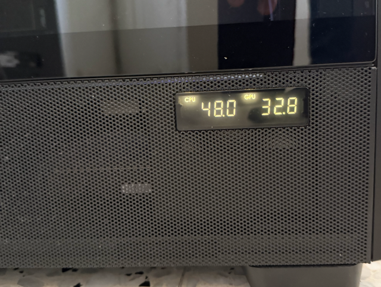

# Antec Flux Pro Display Driver for Windows

Open-source replacement for **Antec iUnity** that drives the side-panel
display ("Vortex View Screen") on Antec Flux Pro and Vortex View 360 cases.

> Tired of iUnity freezing every few hours? **You're not alone.** This tool
> replaces it with ~250 lines of PowerShell. No background bloat,
> no random "Connection Error" popups, no unexplained freezes.



---

## Why this exists

Antec's official iUnity software has well-documented stability issues:

- The `iUnityService` process freezes after a few hours of operation
- Display goes blank while the service still appears "Running"
- iUnity GUI shows `Connection Error` and "Restart" button often fails to fix it
- Process uses 200+ MB of RAM as an Electron app

This tool is a clean replacement that does **only** what's needed:

- Reads CPU and GPU temperatures
- Sends them to the display every second over USB HID
- Runs as a Windows Scheduled Task (boots automatically, ~10 MB RAM)
- Logs activity to a small file you can tail

---

## Compatibility

**Tested on:**
- Antec Flux Pro (Vortex View Screen)
- Intel Core Ultra 9 285K (Arrow Lake) on ASUS ProArt Z890-CREATOR WIFI
- NVIDIA RTX 5070
- Windows 11 Pro

**Should work on:**
- Any case using the Vortex View Screen with USB device VID `0x2022` PID `0x0522`
- Antec Vortex 360 AIO with the same display
- Most Intel CPUs supported by LibreHardwareMonitor + PawnIO
- AMD CPUs (untested, but PawnIO supports AMD MSRs)
- NVIDIA GPUs (uses NVML); should work for AMD via LibreHardwareMonitor too

If you have different hardware and it works (or doesn't), please open an issue
or pull request to update this list.

---

## Installation

### 1. Download the latest release

Grab `antec-flux-pro-display-windows.zip` from the [Releases page](../../releases)
and extract it somewhere convenient (e.g. `C:\Tools\antec-display\`).

### 2. Run the installer as administrator

```powershell
cd C:\Tools\antec-display
.\install.ps1
```

The installer will:
1. Verify all required files are present
2. Install PawnIO driver if not already installed (a small signed kernel driver)
3. Create a Scheduled Task that runs the tool as SYSTEM at every boot
4. Start the tool immediately

### 3. Verify it's working

```powershell
.\verify.ps1
```

You should see all green checkmarks. The display should now show your CPU and GPU
temperatures, updating every second.

---

## How it works

The Antec Vortex View Screen is a USB HID device that accepts a 12-byte packet:

```
[0x55, 0xAA, 0x01, 0x01, 0x06,
 cpu_tens, cpu_ones, cpu_tenths,
 gpu_tens, gpu_ones, gpu_tenths,
 checksum]   # wrapping byte sum of the previous 11 bytes
```

We send one of these every second. That's it.

CPU temperature comes from [LibreHardwareMonitorLib](https://github.com/LibreHardwareMonitor/LibreHardwareMonitor)
(uses [PawnIO](https://github.com/namazso/PawnIO) under the hood for kernel access).
GPU temperature comes from the same library (uses NVML for NVIDIA).

The protocol was reverse-engineered by [@nishtahir](https://github.com/nishtahir/antec-flux-pro-display)
for Linux. This project is the Windows counterpart.

---

## Configuration

The script accepts parameters:

```powershell
.\antec-display.ps1 `
    -PollSeconds 1 `                              # How often to send updates
    -LhmPath "$PSScriptRoot\lhm" `                # Path to LibreHardwareMonitor DLLs
    -LogPath "$env:ProgramData\AntecDisplay\antec_display.log"
```

To change the poll interval permanently, edit the scheduled task arguments
(`Task Scheduler > AntecDisplay > Properties > Actions`) or just edit the
default in `antec-display.ps1` and re-run `install.ps1`.

---

## Useful commands

```powershell
# Live log
Get-Content "$env:ProgramData\AntecDisplay\antec_display.log" -Tail 20 -Wait -Encoding UTF8

# Restart the tool
schtasks /run /tn AntecDisplay

# Stop the tool
schtasks /end /tn AntecDisplay

# Run prerequisites check
.\verify.ps1

# Uninstall (does NOT remove PawnIO)
.\uninstall.ps1
```

---

## Troubleshooting

See [PREREQUISITES.md](PREREQUISITES.md) for a complete checklist of what
needs to be in place and how to diagnose common problems.

---

## What this tool does NOT do

- **Custom layouts / fonts / colors:** the display has fixed firmware that
  shows two values side by side. Anything richer (the layouts iUnity offered)
  uses a different USB protocol that hasn't been reverse-engineered yet.
- **Fan control:** AIO pumps and case fans are typically wired to the
  motherboard's fan headers. Use BIOS / fan-control software for those.
- **RGB control:** if your case fans have RGB, that's a separate
  controller (Aura, iCUE, etc.).

If you want to extend the tool to display additional values like RAM or
storage temperatures, the protocol header byte (`0x06`) might support
additional modes — but in our testing, it didn't change anything.
PRs welcome if you find different modes that work.

---

## Related projects

If this PowerShell approach isn't what you want, there are other options:

- **[nishtahir/antec-flux-pro-display](https://github.com/nishtahir/antec-flux-pro-display)** —
  Linux daemon written in Rust. The original project that documented the USB
  protocol; this Windows port wouldn't exist without it.
- **[shroudedhorizon/antec-flux-pro-display-lightweight](https://github.com/shroudedhorizon/antec-flux-pro-display-lightweight)** —
  Windows alternative written in C# as a system-tray app. Same sensor stack
  (LibreHardwareMonitor + PawnIO), different deployment model (compiled `.exe`
  in user session vs. our PowerShell script running as SYSTEM at boot).

### Why this project vs. the others?

Pick this one if you:
- Prefer a transparent, hackable script you can read and modify in seconds
- Want it to run as a background service from boot (no tray icon, no user login required)
- Like having a built-in `verify.ps1` that runs 15 checks to diagnose problems

Pick `shroudedhorizon`'s if you:
- Prefer a compiled binary you just double-click
- Want a system-tray indicator
- Don't need / want to read the source

Both projects are MIT-licensed and use the same underlying drivers.

## Credits

- **[@nishtahir](https://github.com/nishtahir)** — reverse-engineered the
  USB protocol for the Linux project that made this possible
- **[LibreHardwareMonitor](https://github.com/LibreHardwareMonitor/LibreHardwareMonitor)**
  team — sensor library
- **[PawnIO](https://github.com/namazso/PawnIO)** by @namazso — signed
  kernel driver
- **[HidSharp](https://github.com/IntergatedCircuits/HidSharp)** — .NET HID library

---

## License

MIT — see [LICENSE](LICENSE).

---

## Disclaimer

This is an **unofficial** community tool. Not affiliated with, endorsed by,
or supported by Antec or Brilltek. Use at your own risk. The tool talks
to your hardware via signed kernel drivers (PawnIO) — same as official
sensor utilities — but if anything breaks, you get to keep both pieces.
